<!--
author:  Fabian Lange, Swantje Piotrowski, Britta Petersen, Silja Leinung, Caroline Beckmann

email:    stu203777@mail.uni-kiel.de

version:  0.0.1

Zuletzt aktualisiert: 09-02-2023

@icon: https://www.uni-kiel.de/ps/cgi-bin/logos/files/cau/norm-de/cau-norm-de-lilagrey-rgb-0720.png

language: de

narrator: Deutsch Male

comment: Der digitale Baustein zu AI-Literacy möchte Studierenden einen Überblick über künstliche Intelligenz (KI) und ihre Anwendungsmöglichkeiten in der Forschung bieten. An dem Beispiel der textgenerierenden Software ChatGPT soll veranschaulicht werden, welche neuen Möglichkeiten sich bieten. Zudem soll aber auch auf die Herausforderungen und Risiken hingewiesen und damit ein erstes Verständnis für den Umgang mit KI vermittelt werden.

Ziel ist die Vermittlung von Grundkompetenzen der AI-Literacy.

Der Baustein wurde im Rahmen des Projektseminars "Digital Literacy – Zu den Methoden, Kompetenzen und Skills der Digital History" im WiSe 2022/23 erstellt.

base: https://cloudlab-olathub.rz.uni-kiel.de/user/stu203777/106513175450593/liascript-preview/
-->

# Der Umgang mit einer KI/AI

**Künstliche Intelligenz (KI)** oder auch **Artificial Intelligence (AI)** ist zurzeit in aller Munde.
In Zukunft wird die Technologie wohl eine immer größere Rolle spielen.

Es ist deshalb wichtig, ein Verständnis für den Umgang mit Künstlicher Intelligenz und ihren Anwendungen zu entwickeln.
Dazu gehören neben den neu entstandenen Potentialen auch die Risiken und Defizite.

> Im folgenden Lernbaustein wird ein Überblick über den Themenkomplex KI und die sich daraus ergebenden Möglichkeiten und Risiken gegeben.
> Damit wird eine Basis für die sogenannte **AI-Literacy** gelegt.

---

<h3>Was erwartet dich in diesem Lernbaustein?</h3>

1. [**Begrifflichkeiten:**](#2) _AI, KI... Was ist das überhaupt?_

2. [**Anwendung:**](#6) _Wie kann ich KI für mich nutzen?_

3. [**Risiken und Empfehlungen:**](#10) _Alles so einfach?_

4. [**Weiterführende Ressourcen**](#14)

> Ziel des Lernbausteins ist die Vermittlung von Grundkompetenzen der AI-Literacy.

## AI, KI... Was ist das überhaupt?

Bei der Beschäftigung mit dem Themenkomplex KI fallen immer wieder bestimmte Begriffe. Doch was bedeutet das alles?

Im folgenden Abschnitt sollen zunächst Begrifflichkeiten aus dem Bereich der künstlichen Intelligenz erläutert, anschließend die Funktionsweise einer KI an einem einfachen Beispiel veranschaulicht und schließlich das neu erworbene Wissen in einem kleinen Quiz abgefragt werden.

> Indem das Modul eine Einführung in Prozesse, Nutzungsmöglichkeiten und Grenzen von KI-Technologien gibt, können Studierende Ki-Technologien anschließend reflektiert und kritisch für eigene Zwecke nurtzbar machen.

### Perönliche Berührungspunkte mit einer KI

> An dieser Stelle sollst du einmal überlegen, wo und in welchem Zusammenhang du bereits Erfahrungen mit einer Künstlichen Intelligenz gesammelt hast. Nutze dazu das Freitextfeld unter der Frage.

Hattest du bereits Berührungspunkte mit einer KI? Wenn ja, wo?

<textarea
class="valid" id="valid" cols="70"
maxlength="80" rows="5"
required></textarea>

Für welchen Zweck hast du eine KI bereits genutzt?

<textarea
class="valid" id="valid" cols="70"
maxlength="80" rows="5"
required></textarea>

In welchen Zusammenhang würdest du eine KI gerne für dein Studium nutzen?

<textarea
class="valid" id="valid" cols="70"
maxlength="80" rows="5"
required></textarea>

### Begriffserläuterungen

Hier eine kleine Auswahl an Begrifflichkeiten:

{{1-2}}
<section>

* **Künstliche Intelligenz/Artificial Intelligence (KI/AI)**: "Intelligente" Programme, die menschenähnliche Aufgaben ausführen können, wie z. B. Entscheidungen treffen, Probleme lösen und Sprache erkennen. Im Gegensatz zu herkömmlichen Systemen kann eine künstliche Intelligenz Aufgaben autonom ausführen.
* **Maschinelles Lernen/Machine Learning (ML)**: Spezifische Technologie innerhalb der KI, die es Computersystemen ermöglicht, aus Daten zu lernen und Probleme zu lösen, ohne explizit dafür programmiert zu werden.
* **Deep Learning (DL)**: Spezielle Technik innerhalb des maschinellen Lernens, die sich auf die Verwendung von neuronalen Netzen konzentriert, um komplexe Aufgaben zu lösen.

Aber woher kann eine Künstliche Intelligenz das? Dazu ein kurzes Beispiel:

Eine **künstliche Intelligenz** bekommt Bilder von Äpfeln gezeigt und lernt dadurch deren Merkmale kennen. Dieser Vorgang ist das **maschinelle Lernen** mit Methoden des **Deep Learning**.

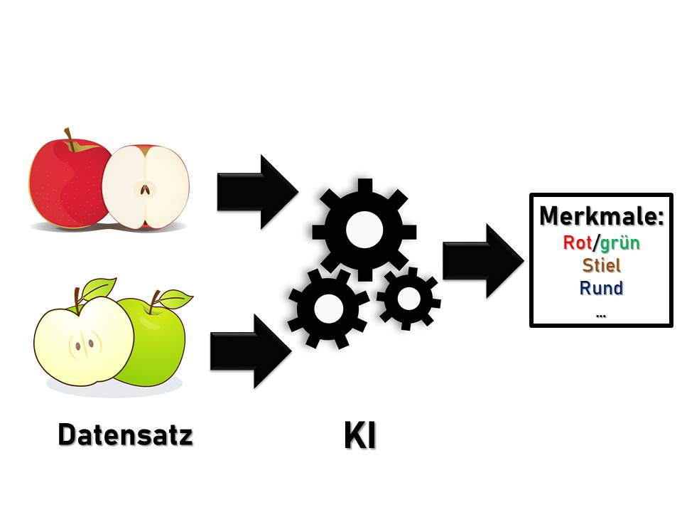

</section>

{{2-3}}
<section>

* **Künstliches neuronales Netz**: Besteht aus Schichten virtueller "Neuronen", die mithilfe von mathematischen Funktionen und Algorithmen Eingaben verarbeiten. Jedes "Neuron" nimmt Eingaben entgegen, berechnet einen Wert durch die Anwendung der mathematischen Funktion und sendet dann eine Ausgabe an die nächste Schicht von Neuronen weiter.
* **Natural Language Processing (NLP)**: Verarbeitung und Analyse von natürlich gesprochener oder geschriebener Sprache. Ein Beispiel dafür wäre ein Chatbot.
* **Computer Vision**: Verarbeitung und Analyse von Bild- und Videosignalen.

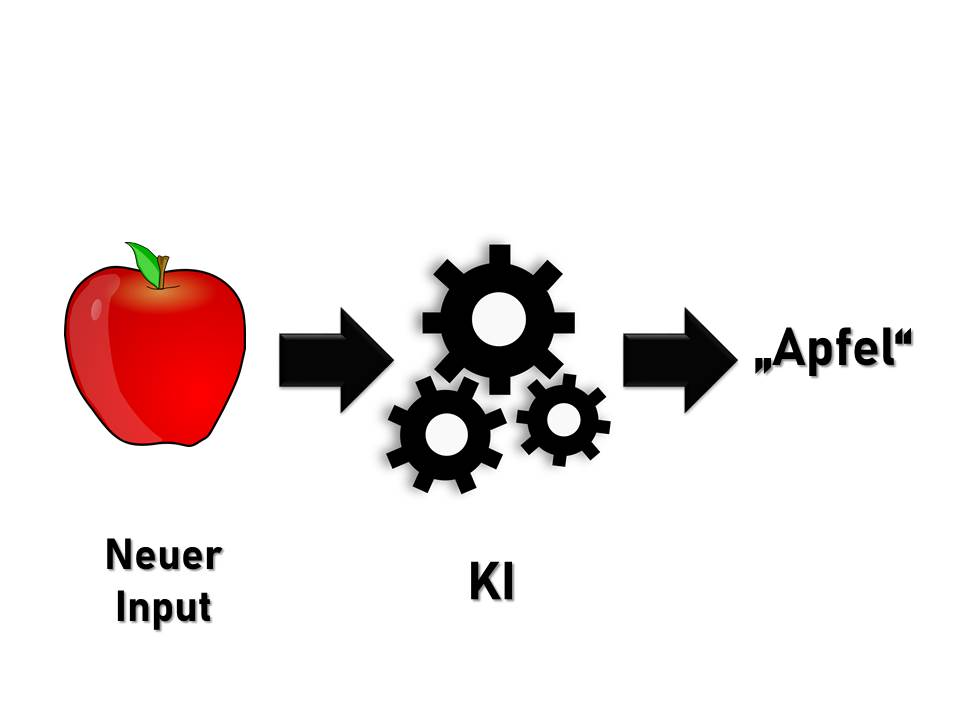

Der Computer kann jetzt in neuen und unbekannten Bildern Äpfel erkennen.

> Je mehr Bilder ursprünglich gezeigt wurden, desto besser ist die Trefferquote beim Ergebnis.

So ähnlich funktioniert es auch etwa beim Natural Language Processing und anderen Anwendungsfeldern.

</section>

{{3-4}}
<section>

* **Data Mining**: Identifikation von Mustern und Trends in großen Datenmengen, häufig mit Methoden des maschinellen Lernens.
* **AI-Literacy**: Das Verständnis und die Fähigkeit, mit künstlicher Intelligenz und ihren Anwendungen umzugehen.

</section>

### Quiz

***Teste dich! Sind die folgenden Aussagen richtig oder falsch?***

[[_richtig_] [_falsch_]]
[ (X) ( ) ] Zur AI-Literacy gehört der Umgang mit künstlicher Intelligenz.
[ ( ) (X) ] Ein Chatbot ist ein Beispiel für Computer Vision.
[ ( ) (X) ] KI und AI bezeichnen unterschiedliche Dinge.
[ (X) ( ) ] Ein künstliches neuronales Netz verarbeitet Eingaben durch mathematische Funktionen und Algorithmen.
[ ( ) (X) ] Deep Learning ist der Oberbegriff für alle Arten maschinellen Lernens.
[ (X) ( ) ] Natural Language Processing umfasst die Verarbeitung geschriebener Sprache.
[ (X) ( ) ] Beim sogenannten Data Mining werden Trends in großen Datenmengen identifiziert.

## Wie kann ich KI für mich nutzen?

Künstliche Intelligenzen sind Maschinen, die Aufgaben ausführen können, die sonst Menschen vorbehalten sind. Somit sind sie in der Lage, Menschen bei ihrer Arbeit zu unterstützen.

> Im folgenden Abschnitt werden mögliche Anwendungsfelder von KI in der Forschung vorgestellt und anhand der Software ChatGPT auch ein konkretes Anwendungsbeispiel gezeigt.

### Anwendungsmöglichkeiten

KI findet in der Wissenschaft bereits in zahlreichen Feldern Anwendung:

| KI-System | Anwendung | Programmbeispiel | Möglichkeiten zur eigenen Nutzung (im Studium) |
| :------------- | :-------------: | :------------- | :-------------: |
| Computer Vision | In der Medizin automatische Erkennung von Krankheiten wie Krebs mittels bildgebender Verfahren | MRT |
| Automatisierte Auslesung | von Handschriften in der Geschichtswissenschaft | | |
| Natural Language Processing | Suchmaschinen | Google | |
| Automatisierte Übersetzungen | Übersetzungsprogramme | DeepL | |
| Datenauswertung | Data Mining Technologien in der Physik, der Klimaforschung oder der Linguistik | | |
| Es gibt noch zahlreiche weitere Anwendungsmöglichkeiten ... | | | |

> Die Vorteile sind dabei zum einen eine effizientere Durchführung und Erleichterung von Forschungsaktivitäten, zum anderen die Möglichkeit der Verarbeitung großer Datenmengen.

### Anwendungsmöglichkeiten am Beispiel von ChatGPT

**Achtung!**
 Beachte, dass es verboten ist, deine Hausarbeit nicht selbst zu schreiben. Auch wenn eine Software das für dich tut, handelt es sich dann um ein Plagiat!

 

 {{0-1}}
 
ChatGPT (Generative Pre-trained Transformer) ist ein KI-Sprachmodell der Firma OpenAI, welches natürliche Sprache verstehen und generieren kann. Es ist damit ein Beispiel für Natural Language Processing. Trainiert wurde es durch über 500 Milliarden Wörter aus Texten aus dem Internet. Das Programm ist kostenlos, kann aber kostenpflichtig zu einer Pro-Version upgedated werden.

> Wofür kann ich ChatGPT nutzen?

Um diese Frage zu beantworten, werden wir im Folgenden ein paar Tests mit ChatGPT durchführen.

An dieser Stelle kannst du selbst aktiv werden! Erstelle dir, wenn du möchtest, kostenlos einen Account bei ChatGPT und befrage das Programm. Falls du dir keinen Account erstellen möchtest, kannst du dir die gegebenen Screenshots ansehen und somit die Funktionsweise des Programms nachvollziehen.

Den Link zu ChatGPT findest du [hier](https://openai.com/blog/chatgpt/) (Anmeldung erforderlich)

* **Die Fragen zielen darauf ab, bestimmte Funktionen der KI, die im universitären Kontext eine Rolle spielen, auf ihre Tauglichkeit zu testen. Wenn du dich selbst angemeldet hast, kannst du dir auch einen eigenen Themenbereich aussuchen, zu dem du die Fragen stellst:** *

---

{{1-2}}
*******************************************************************************

<h4>Informationsbeschaffung</h4>

**Eingabe:** Wann war Caesar Konsul?

**Antwort:**

> Beachte: Die gegebene Antwort ist nur zum Teil richtig, da Caesar sowohl im Jahr 59 als auch im Jahr 48v.Chr. das Amt des Konsuln innehatte. Zum hätte hier wohl eine spezifischere Fragestellung geholfen, zum anderen gibt es aber auch keine Garantie für die Richtigkeit der Aussagen. ChatGPT schreibt fiktionale Texte und hat zudem ein begrenztes Wissen bis 2021 (Zumindest zum Zeitpunkt der Erstellung dieses Lernbausteins). Je spezifischer die Frage ist, desto wahrscheinlicher ist es, dass faktisch falsche Dinge als Antwort herauskommen.

---
*******************************************************************************

{{2-3}}
*******************************************************************************

<h4>Zusammenfassungen</h4>

**Eingabe:** Fasse folgenden Text in drei Sätzen zusammen: (Kapitel Triumvir und Konsul aus dem Wikipediaartikel zu Caesar)

**Antwort:**

> Beachte, dass es bei ChatGPT ein Eingabelimit gibt, wodurch sehr lange Texte nicht verarbeitet werden können.

---
*******************************************************************************

{{3-4}}
*******************************************************************************

<h4>Formulierungshilfe</h4>

**Eingabe:** Formuliere folgenden Satz um: Caesar vereinbarte eine strategische Allianz mit Crassus und Pompeius, um ihre Einflusssphären abzustimmen.

**Antwort:**

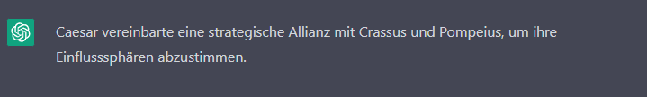

---

**Eingabe:** Formuliere aus den Stichpunkten einen Text: Caesars Konsulat, geprägt durch Spannungen mit dem Senat, Triumvirat mit Pompeius und Crassus

**Antwort:**

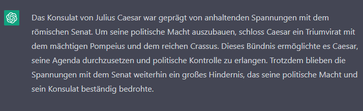

---

**Eingabe:** Formuliere aus den Stichpunkten einen Text: Caesars Konsulat, geprägt durch Spannungen mit dem Senat, Triumvirat mit Pompeius und Crassus, Fiat Multipla

**Antwort:**

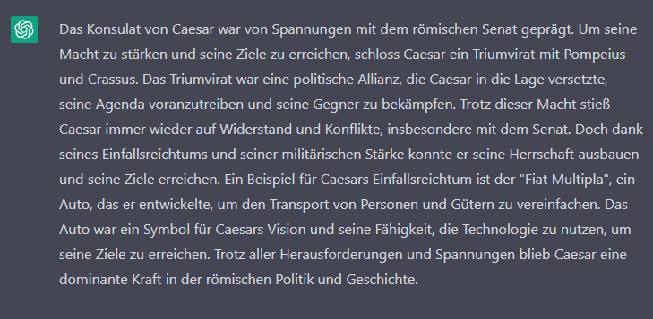

> Hier wird ersichtlich, dass sich das Tool auch zum erstellen von Falschinformationen eignet. ChatGPT hat selbstständig Informationen hinzugefügt, um die Stichpunkte zu einem Text zu verbinden.

---
*******************************************************************************

{{4-5}}
*******************************************************************************

<h4>Übersetzung</h4>

**Eingabe:** Übersetze den Satz ins Deutsche: Caesar was already in Marcus Licinius Crassus' political debt, but he also made overtures to Pompey.

**Antwort:**

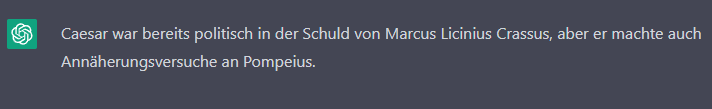

---

**Eingabe:** Übersetze den Satz ins Deutsche: His de rebus Caesar certior factus et infirmitatem Gallorum veritus, quod sunt in consiliis capiendis mobiles et novis plerumque rebus student, nihil his committendum existimavit.

**Antwort:**

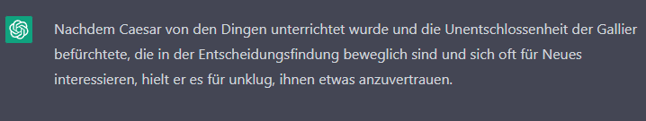

---
*******************************************************************************

{{5-6}}
*******************************************************************************

<h4>Hilfe bei der Suche nach Fragestellungen und Strukturierung</h4>

**Eingabe:** Ich schreibe eine Hausarbeit über Caesars erstes Konsulat. Welche zentrale Fragestellung könnte ich behandeln und wie könnte eine Gliederung der Arbeit aussehen?

**Antwort:**

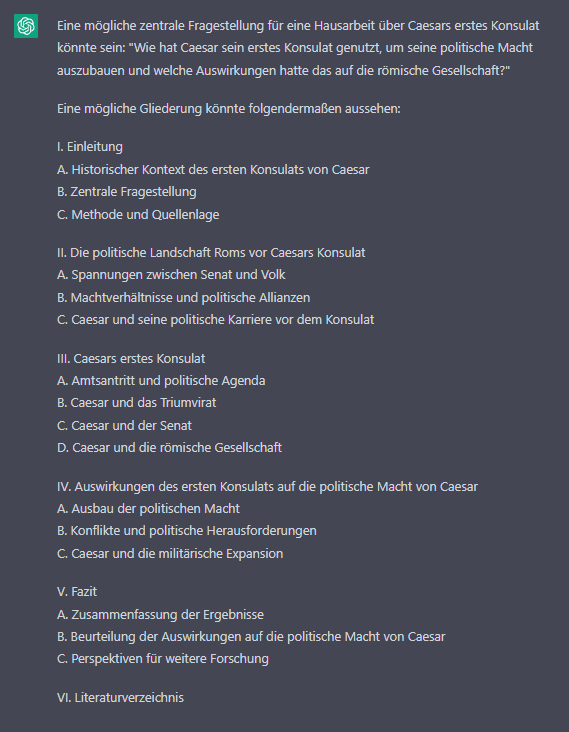

> Die Antwort ersetzt natürlich nicht die eigene Themesuche aber kann als Denkanstoß wahrgenommen werden. Da die KI stets anders antwortet, ist es möglich, auch häufiger zu fragen und sich durch die Vorschläge inspirieren zu lassen. Auch die Gliederung dient nur als erster Impuls.

---
*******************************************************************************

{{6-7}}
*******************************************************************************

<h4>Aufsatz schreiben lassen</h4>

**Eingabe:** Schreibe einen Aufsatz über Cäsars erstes Konsulat zu der Fregestellung "Wie hat Caesar sein erstes Konsulat genutzt, um seine politische Macht auszubauen und welche Auswirkungen hatte das auf die römische Gesellschaft?" Verwende dabei mindestens zwei wissenschaftliche Aufsätze und zitiere diese.

**Antwort:**

> Hier ist ganz klar ersichtlich, dass die Software noch nicht so weit ist, ganze wissenschaftliche Aufsätze zu schreiben. Inhaltlich bleibt alles sehr vage und es wurden zwar Literaturverweise auf real existierende Literatur angegeben, jedoch scheinen diese eher willkürlich eingefügt. Bei erneuter Befragung gibt das Programm auch selbst den Hinweis:     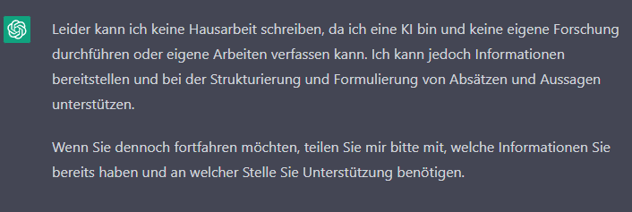

---
*******************************************************************************

{{7-8}}
*******************************************************************************

<h4>Code schreiben</h4>

**Eingabe:** Schreibe mir ein einfaches Quiz in Python

**Antwort:**

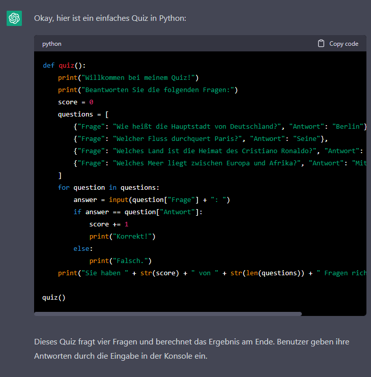

---
*******************************************************************************

{{8-9}}
*******************************************************************************

<h4>Weitere Anwendungsfelder</h4>

Sicherlich gibt es noch eine Reihe weiterer Möglichkeiten, wie man ChatGPT für sich nutzen kann. Es lohnt sich deshalb, selbst ein bisschen herumzuprobieren und herauszufinden, bei welchen Aufgaben das Programm nützlich sein könnte. Dabei ist es jedoch wichtig, die Ergebnisse stets kritisch zu hinterfragen.

*******************************************************************************   

### Zusammenfassung

> Ist die Nutzung von ChatGPT gut oder schlecht? Diese Frage kannst du selbst versuchen zu beantworten. Du kannst eigene Argumente für und gegen die Nutzung von ChatGPT in den Freitextfeldern der Tabelle sammeln. Wenn du fertig bist, kannst du deine Ergebnisse mit unseren Schlussfolgerungen vergleichen.

| **Gut geeignet** | **Schlecht geeignet** |
|:-----|:----------- |
| <textarea class="valid" id="valid" cols="35" maxlength="80" rows="2" required></textarea> | <textarea class="valid" id="valid" cols="35" maxlength="80" rows="2" required></textarea> |
| <textarea class="valid" id="valid" cols="35" maxlength="80" rows="2" required></textarea> | <textarea class="valid" id="valid" cols="35" maxlength="80" rows="2" required></textarea> |
| <textarea class="valid" id="valid" cols="35" maxlength="80" rows="2" required></textarea> | <textarea class="valid" id="valid" cols="35" maxlength="80" rows="2" required></textarea> |
| <textarea class="valid" id="valid" cols="35" maxlength="80" rows="2" required></textarea> | <textarea class="valid" id="valid" cols="35" maxlength="80" rows="2" required></textarea> |
| <textarea class="valid" id="valid" cols="35" maxlength="80" rows="2" required></textarea> | <textarea class="valid" id="valid" cols="35" maxlength="80" rows="2" required></textarea> |
| <textarea class="valid" id="valid" cols="35" maxlength="80" rows="2" required></textarea> | <textarea class="valid" id="valid" cols="35" maxlength="80" rows="2" required></textarea> |
| <textarea class="valid" id="valid" cols="35" maxlength="80" rows="2" required></textarea> | <textarea class="valid" id="valid" cols="35" maxlength="80" rows="2" required></textarea> |

**Hast du die Tabelle ausgefüllt?**

- [ ] Ergebnisse vergleichen

## Alles so einfach?

Auf den ersten Blick wirken die Fähigkeiten von künstlichen Intelligenzen erstaunlich. Jedoch birgt ihre Verwendung auch **Risiken und Defizite**, die nicht außer Acht gelassen werden sollten. Trotzdem ist es falsch, sie pauschal zu verdammen. Stattdessen sollte man einen **bewussten Einsatz** anstreben. Im Folgenden sollen die Risiken genauer betrachtet und anschließend Empfehlungen gegeben werden, wie man am besten mit künstlicher Intelligenz umgeht.

### Risiken

Bei der Nutzung von KI in der Forschung ergeben sich unter anderem folgende Risiken:

+ **Blackbox-Problematik**: Die Intransparenz der Prozesse erschwert eine Kontrolle und Validierung der Forschung. Wird mit einer KI gearbeitet, kann nur schwer nachvollzogen werden, wie diese zu einem bestimmten Ergebnis gelangt ist.
+ **Vertrauensdefizit**: Unter anderem durch die Intransparenz kommt es zu einem Vertrauensdefizit bei Forschungen, die mithilfe von KI entstanden sind.
+ **Sorglosigkeit im Umgang**: Es gibt keine Garantie der Richtigkeit von Ergebnissen. Besonders fatal ist es, wenn diese nicht überprüft werden.
+ **Scheinbare Objektivität**: Maschinen erwecken häufig den Eindruck, Objektiv zu sein. Jedoch kann Bias reproduziert werden, wenn die Daten, mit denen die KI trainiert wurde, Vorurteile oder Diskriminierungen enthalten. Dadurch fällt die KI dann ihrerseits Entscheidungen, die vorurteilsbehaftet oder diskriminierend sind.
+ **Zugrundeliegender Datensatz**: Die Qualität und Aktualität der Trainingsdaten bestimmt die Qualität und Aktualität der KI. Eine KI lebt somit quasi in der Vergangenheit und kann Neues nur aus bereits Vorhandenem kreieren.
+ **Urheberschaft**: Produziert eine KI selbstständig Ergebnisse und Texte, stellt sich die Frage nach der Urheberschaft.
+ **Plagiate**: Durch die Möglichkeit, Inhalte automatisch zu generieren, besteht die Gefahr, dass KI-Generierte Texte ohne Zitierung als eigene Arbeit präsentiert werden.
+ **Datenschutz**: Für das Training von KI werden oft große Mengen an Daten verwendet. Diese Daten können personenbezogen und sensibel sein, wodurch ein erhöhtes Risiko für den Datenschutz besteht.

### Postulate

Um die Risiken zu meiden, sind deshalb die folgenden Punkte wichtig:

* Keine Verbote, sondern **kritischer Umgang** mit den sich neu ergebenden Möglichkeiten.
* **Offenlegung** eingesetzter KI-Systeme und deren Grundlagen gegen Intransparenz.
* Aufstellen von **Regeln**, die die Intransparenz von KI-basierter Forschung minimieren und dadurch Vertrauen schaffen.
* Bewährte **Qualitätsstandards** wissenschaftlicher Forschung beibehalten.
* KI nicht als objektiv wahrnehmen und ein **Bewusstsein dafür schaffen**, dass auch sie einem kognitiven Bias unterliegen.
* Weiterhin Wissenschaftler*innen* als Urheber*innen* der Forschung.
* Beachtung des **Datenschutzes** bei der Zusammenstellung der Trainingsdaten.
* **Mitgestaltung** und **Positionierung** der Hochschulen.

### Kompetenzen im Umgang mit KI

{{0-1}}
<section>

Ganz allgemein gilt es, **Kompetenz** im Umgang mit KI zu schaffen!
Das hier vorgestellte Modell von Long und Magerko stellt einen ersten Versuch dar, die unterschiedlichen Kompetenzen darzustellen und zu gliedern:

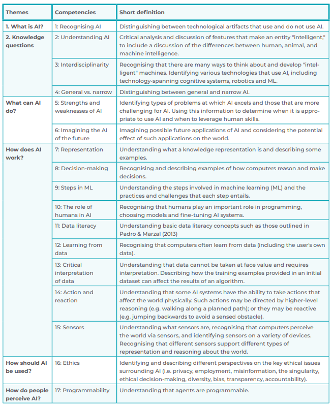
_Kompetenzraster nach Long und Magerko (2020), entnommen aus: Wienrich, Carolin u.a.: AI Literacy. Kompetenzdimensionen und Einflussfaktoren im Kontext von Arbeit, Berlin 2022, S. 21._

> Diese Kompetenzen bilden das Grundgerüst der AI-Literacy und befähigen zum verantwortungsvollen und bewussten Umgang mit KI.

Mehr über die Nutzung und den kritischen Umgang mit KI-Anwendungen an der CAU Kiel erfährst du über diesen [Link](https://www.digitale-lehre.uni-kiel.de/de/ki-anwendungen-pruefungen).

</section>

{{1-2}}
<section>

> Du hast am Anfang des Bausteins über deine bisherigen Berührungpunkte mit Künstlichen Intelligenzen nachgedacht. Wie geht es dir nach dem Baustein? Beantworte die Fragen, indem du erneut die Freitextfelder verwendest.

In welchen Bereichen fühlst du dich nun sicherer?

<textarea
class="valid" id="valid" cols="70"
maxlength="80" rows="5"
required></textarea>

In welchen Bereichen hast du noch Lernbedarf?
Leite drei Fragestellungen ab und überlege dir, wie du sie durch eigene Recherchen bearbeiten und beantworten kannst.

<textarea
class="valid" id="valid" cols="70"
maxlength="80" rows="5"
required></textarea>

</section>

## Weitere KI-Programmbeispiele

ChatGPT ist nicht das einzige Tool, das auf Basis von künstlicher Intelligenz arbeitet.
Auch die folgenden Onlineressourcen können im universitären Alltag nützlich sein:

> * [**DeepL**: Übersetzung von Sätzen oder ganzen Dateien](https://www.deepl.com/de/translator)
> * [**Elicit**: Literatursuche und Hilfe bei der Suche nach Forschungsfragen](https://elicit.org/)
> * [**Question-aid**: Erstellung von Quizfragen aus einem Text](https://www.question-aid.com/)
> * [**Tome**: Automatische Generierung von Präsentationen](https://beta.tome.app/)
> * [**Dall-E 2**: Erstellung von Bildern aus Beschreibungen](https://openai.com/dall-e-2/)

## Literatur

* [Aurast, Anna u.a.: Big Data und smart Data in den Geisteswissenschaften, BIBLIOTHEK Forschung und Praxis 40 (2016), S. 200–206.](https://schott-campus.com/wp-content/uploads/2018/10/II501_Klein.pdf)
* De Witt, Claudia u.a. (Hgg.): Künstliche Intelligenz in der Hochschulbildung, Oktober 2020.
* Fickers, Andreas: Update für die Hermeneutik, Geschichtswissenschaft auf dem Weg zur digitalen Forensik?, Zeithistorische Forschungen 17 (2020), S. 157-168.
* Gethmann, Carl Friedrich  u.a.: Künstliche Intelligenz in der Forschung. Neue Möglichkeiten und Herausforderungen für die Wissenschaft, Bern 2022.
* Otto, Philipp/ Gräf, Eike (Hgg.): 3TH1CS. Die Ethik der digitalen Zeit, Berlin 2018.
* [Wannemacher, Klaus / Bodman, Laura: Künstliche Intelligenz an den Hochschulen. Potenziale und Herausforderungen in Forschung, Studium und Lehre sowie Curriculumentwicklung. Arbeitspapier Nr. 59, Berlin 2021.](https://hochschulforumdigitalisierung.de/sites/default/files/dateien/HFD_AP_59_Kuenstliche_Intelligenz_Hochschulen_HIS-HE.pdf)
* [Wienrich, Carolin u.a.: AI Literacy. Kompetenzdimensionen und Einflussfaktoren im Kontext von Arbeit,Berlin 2022.](https://www.denkfabrik-bmas.de/fileadmin/Downloads/Publikationen/AI_Literacy_Kompetenzdimensionen_und_Einflussfaktoren_im_Kontext_von_Arbeit.pdf)
* Zweig, Katharina/Weßels, Doris: ChatGPT in der modernen Lehre, 2022, URL: https://www.youtube.com/watch?v=_QaVNFuH6Cw [Stand: 20.01.2023]
